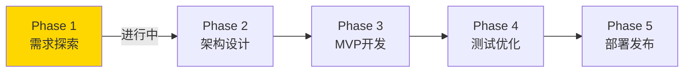

# BMAD-METHOD 进度跟踪

## 📊 当前阶段

**当前状态**: 🟡 Phase 1 - 需求探索进行中

---

## ✅ 已完成事项

### 项目初始化
- [x] 创建项目目录
- [x] 初始化 Git 仓库
- [x] 创建 package.json
- [x] 创建 .gitignore
- [x] 创建 README.md
- [x] 创建 .claude.md (AI 助手指南)
- [x] 创建文档目录结构

### 文档
- [x] 用户故事初稿 (docs/requirements/user-stories.md)
- [x] 架构概述初稿 (docs/architecture/overview.md)

---

## 🔄 进行中

### Phase 1: 需求探索
- [ ] 与用户确认核心功能范围
- [ ] 确定 MVP 功能列表
- [ ] 用户故事优先级排序
- [ ] 确定存储方案
- [ ] 确定认证方案

---

## 📋 待办事项

### Phase 2: 架构设计
- [ ] 完成技术选型
- [ ] 设计 API 接口
- [ ] 设计数据库 Schema
- [ ] 设计组件架构

### Phase 3: MVP 开发
- [ ] 搭建项目脚手架
- [ ] 实现用户认证
- [ ] 实现文件上传
- [ ] 实现文件列表
- [ ] 实现文件下载
- [ ] 实现文件删除

### Phase 4: 测试与优化
- [ ] 编写测试用例
- [ ] 性能优化
- [ ] 安全审查

### Phase 5: 部署
- [ ] 配置 Vercel 项目
- [ ] 设置环境变量
- [ ] 部署到生产环境

---

## 📝 会议/讨论记录

### 2024-12-12 - 项目启动
**参与者**: 用户, AI 助手
**讨论内容**:
- 确定使用 BMAD-METHOD 方法论
- 确定技术栈方向 (Next.js + Vercel)
- 创建初始项目结构

**决策**:
1. 采用 Next.js App Router
2. 部署到 Vercel
3. 先完成需求探索再写代码

**下一步**:
1. 确认功能范围
2. 选择存储方案
3. 选择认证方案

---

## ❓ 待决定事项

| 问题 | 选项 | 状态 |
|------|------|------|
| 文件存储 | Vercel Blob / S3 / R2 | 🔶 待定 |
| 数据库 | Vercel Postgres / PlanetScale | 🔶 待定 |
| 认证 | NextAuth / Clerk | 🔶 待定 |
| UI 组件库 | shadcn/ui / Radix | 🔶 待定 |
| 最大文件大小 | ? MB | 🔶 待定 |
| 免费存储额度 | ? GB | 🔶 待定 |

---

*最后更新: 2024-12-12*

