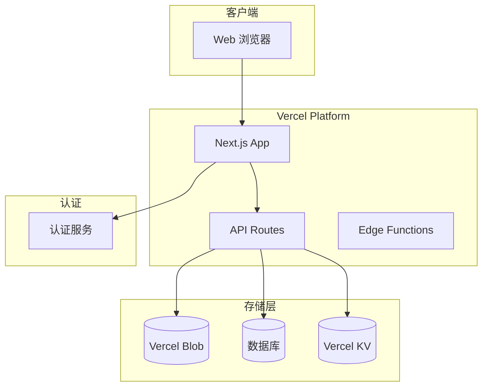
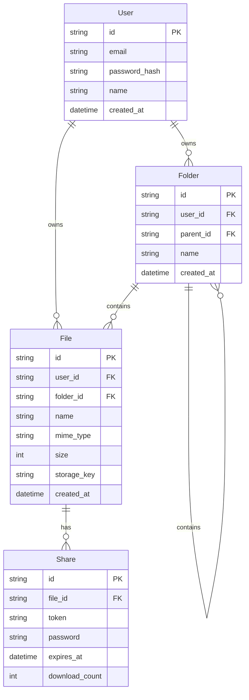
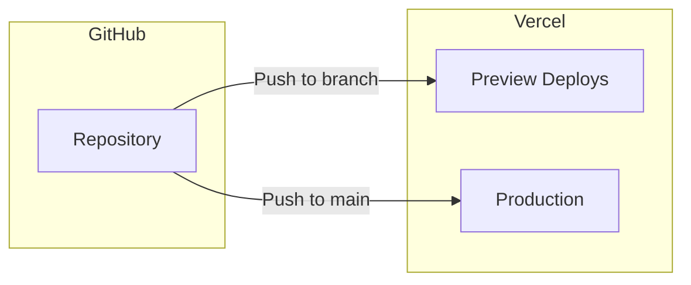

# 系统架构概述

> BMAD-METHOD Phase 2: 架构设计

## 📐 高层架构



## 🔧 技术选型 (待确定)

### 前端
| 技术 | 选择 | 状态 |
|------|------|------|
| 框架 | Next.js 14+ | ✅ 确定 |
| 语言 | TypeScript | ✅ 确定 |
| UI 库 | TBD (Tailwind + shadcn/ui?) | 🔶 待定 |
| 状态管理 | TBD (Zustand / Jotai?) | 🔶 待定 |

### 后端
| 技术 | 选择 | 状态 |
|------|------|------|
| Runtime | Node.js 18+ | ✅ 确定 |
| API | Next.js API Routes | ✅ 确定 |
| ORM | TBD (Prisma / Drizzle?) | 🔶 待定 |

### 存储
| 用途 | 选项 | 状态 |
|------|------|------|
| 文件存储 | Vercel Blob / S3 / R2 | 🔶 待定 |
| 数据库 | PostgreSQL (Vercel) / PlanetScale | 🔶 待定 |
| 缓存 | Vercel KV / Redis | 🔶 待定 |

### 认证
| 选项 | 优点 | 缺点 |
|------|------|------|
| NextAuth.js | 免费、灵活 | 需要自行配置 |
| Clerk | 功能完善、UI 好 | 有免费额度限制 |
| Auth0 | 企业级 | 较复杂 |

## 📁 目录结构规划

```
src/
├── app/                      # Next.js App Router
│   ├── (auth)/               # 认证相关页面
│   │   ├── login/
│   │   ├── register/
│   │   └── forgot-password/
│   ├── (dashboard)/          # 主应用页面
│   │   ├── files/
│   │   ├── shared/
│   │   └── settings/
│   ├── api/                  # API 路由
│   │   ├── files/
│   │   ├── folders/
│   │   ├── share/
│   │   └── auth/
│   ├── layout.tsx
│   └── page.tsx
├── components/               # React 组件
│   ├── ui/                   # 基础 UI 组件
│   ├── files/                # 文件相关组件
│   ├── layout/               # 布局组件
│   └── shared/               # 共享组件
├── lib/                      # 工具库
│   ├── api/                  # API 客户端
│   ├── auth/                 # 认证逻辑
│   ├── storage/              # 存储逻辑
│   └── utils/                # 工具函数
├── hooks/                    # 自定义 Hooks
├── types/                    # TypeScript 类型
└── styles/                   # 全局样式
```

## 🔐 安全考虑

### 文件安全
- 文件上传验证（类型、大小）
- 病毒扫描（可选）
- 访问控制（基于用户）

### API 安全
- 认证/授权
- Rate Limiting
- CORS 配置
- Input 验证

### 数据安全
- 传输加密 (HTTPS)
- 敏感数据加密存储
- SQL 注入防护

## 📊 数据模型草图



## 🚀 部署架构



## ⚡ 性能优化策略

1. **图片优化**: Next.js Image 组件
2. **代码分割**: 动态导入
3. **缓存策略**: 
   - 静态资源 CDN 缓存
   - API 响应缓存
4. **边缘计算**: Edge Functions for 认证检查

---

*文档更新于: 2024-12-12*
*状态: 草稿 - 待评审*

